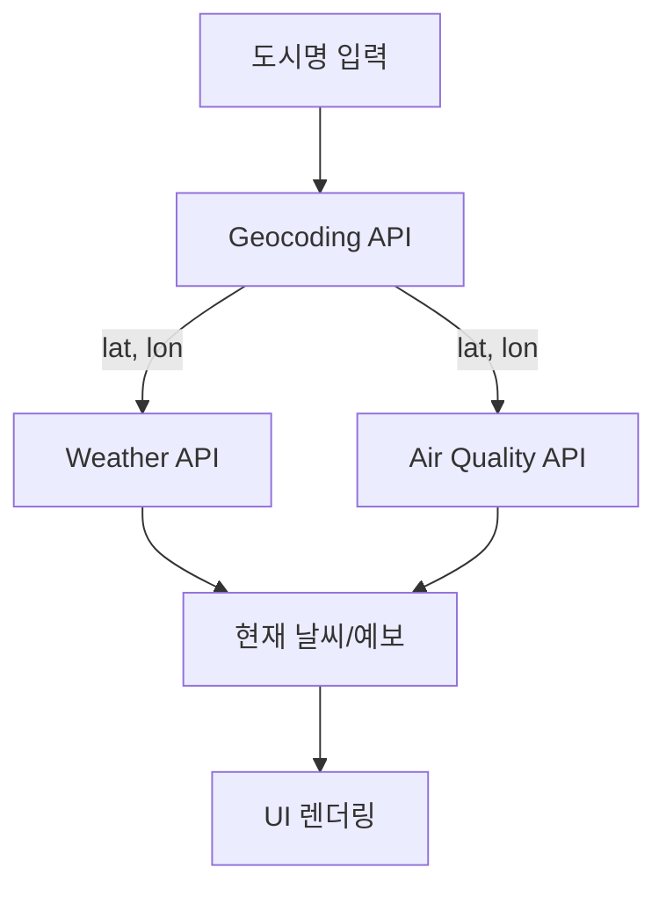

# 🌤️ 날씨날씨 — React + Vite Weather Mini App


> ☀️🌧️❄️ Open‑Meteo API + Geocoding + Air Quality · GitHub Pages 배포용 🌬️🌍

## 🚀 데모

👉 [날씨날씨 데모 보러가기](https://leahkim-dev.github.io/Weather-mini/)

---

## ✨ 기능

* 🔎 도시 자동완성(지오코딩, 3글자 이상) + ⌨️ 키보드 네비게이션(↑/↓/Enter/Esc)
* 🌡️ 현재 날씨(기온/체감/습도/바람/자외선) + 🌬️ 대기질(AQI/PM10/PM2.5)
* 📅 14일 **일간 예보**, 🕐 현지시각 기준 **24시간 시간대별 예보**
* 🎨 날씨 코드별 **동적 테마/이모지**
* ⭐ 즐겨찾기(최대 5개) & 🕑 최근 검색(최대 10개)
* ⚠️ API 오류 시 **서울 좌표** 폴백


---

## 🛠 기술스택

* ⚛️ **React + Vite**
* 🌍 **Open‑Meteo APIs**: Geocoding, Forecast, Air Quality
* 🎨 CSS‑in‑JS(Inline style) 기반 간단한 UI

---

## 📖 빠른 시작

```bash
# 1) 설치
npm i

# 2) 로컬 개발 서버
npm run dev

# 3) 프로덕션 빌드 (dist/ 생성)
npm run build

# 4) 로컬에서 빌드 미리보기
npm run preview
```

> 🗂 배포는 `dist/` 폴더의 정적 파일을 올리면 끝. (GitHub Pages/Netlify 등)


---

## 📜 스크립트

* ▶️ `dev` : 개발 서버(HMR)
* 🏗️ `build` : 프로덕션 번들 생성(`dist/`)
* 👀 `preview` : 빌드 결과 미리보기

---

## 📂 폴더 구조

```
Weather-mini/
├─ src/               # 소스 코드
│ ├─ App.jsx          # 메인 앱 컴포넌트
│ ├─ main.jsx         # React 엔트리 포인트
│ ├─ index.css        # 전역 스타일
│ └─ assets/          # 리소스
│
├─ public/            # 정적 파일
├─ dist/      
├─ index.html         # Vite 엔트리 HTML
├─ package.json       # 의존성 및 스크립트
├─ vite.config.js     # Vite 설정
└─ README.md
```

---

## 🔑 환경변수

* 필요 없음. 모든 API가 Public endpoint 사용.

---

## 🌐 GitHub Pages 배포

### 1) 리포지토리 타입 확인

* 🏠 **User/Org 페이지**(`username.github.io`)면 `vite.config.[ts|js]`의 `base` 설정 불필요.
* 📁 **프로젝트 페이지**(`username.github.io/repo`)면 `vite.config`에 `base: "/<repo>/"` 필요.
  ```js
  // vite.config.js
  import { defineConfig } from 'vite'
  import react from '@vitejs/plugin-react'

  export default defineConfig({
    plugins: [react()],
    base: '/Weather-mini/',
  })
  ```

### 2) GitHub Actions로 자동 배포

루트에 `.github/workflows/deploy.yml` 파일 생성:

```yaml
name: Deploy Vite site to GitHub Pages

on:
  push:
    branches: [ main ]
  workflow_dispatch:

permissions:
  contents: read
  pages: write
  id-token: write

concurrency:
  group: pages
  cancel-in-progress: false

jobs:
  build:
    runs-on: ubuntu-latest
    steps:
      - uses: actions/checkout@v4
      - uses: actions/setup-node@v4
        with:
          node-version: 20
          cache: 'npm'
      - run: npm ci
      - run: npm run build
      - uses: actions/upload-pages-artifact@v3
        with:
          path: ./dist

  deploy:
    needs: build
    runs-on: ubuntu-latest
    environment:
      name: github-pages
      url: ${{ steps.deployment.outputs.page_url }}
    steps:
      - id: deployment
        uses: actions/deploy-pages@v4

```

### 3) GitHub Pages 설정

- 리포 **Settings → Pages → Source** 를 GitHub Actions로 변경

- 이후 main 브랜치에 push하면 자동으로 빌드 + 배포됨

### 4) 배지 추가 (README 상단에 넣기)


---

## 🌍 Open‑Meteo 엔드포인트

* 📍 Geocoding: https://geocoding-api.open-meteo.com/v1/search
* 🌦️ Forecast: https://api.open-meteo.com/v1/forecast
* 🌬️ Air Quality: https://air-quality-api.open-meteo.com/v1/air-quality

요청 파라미터(본 앱에서 사용):

| 구분    | 파라미터 목록 |
|--------|-----------------------------------------------|
| current | temperature_2m, apparent_temperature, relative_humidity_2m, wind_speed_10m, weather_code, uv_index |
| daily   | temperature_2m_max, temperature_2m_min, weather_code |
| hourly  | temperature_2m, weather_code, precipitation_probability, uv_index |
| 기타    | timezone=auto, forecast_days=14 |

---

## 📝 사용법

1. 상단 입력에 도시명 입력(예: `Seoul`, `Tokyo`, `Paris`) → 3글자 이상이면 자동완성
2. 자동완성 목록에서 클릭 또는 키보드(↑/↓/Enter)
3. 선택하면 현재 날씨/대기질 + 일간/시간별 탭이 표시됨
4. 오류 시 서울 좌표로 폴백하여 예보 제공

---

## ✔️ Next Steps

* 🖋️ 인라인 스타일의 `!important`는 적용되지 않음 → CSS 클래스로 분리 권장
* ♿ 접근성: 자동완성/탭 버튼에 `aria-*` 속성 추가 가능
* 💾 상태 저장(favorites/recent) 로컬스토리지 연동 고려

---

## 📄 라이선스

MIT
